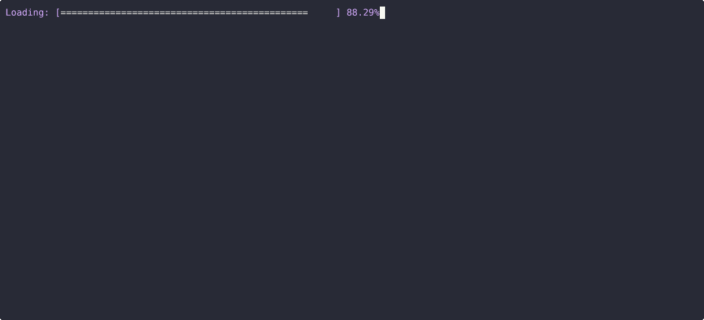

# Acelerador de Produto Escalar para SoC LiteX na FPGA

Este projeto implementa um System-on-Chip (SoC) baseado em LiteX para a FPGA Colorlight i5, contendo um processador RISC-V e um acelerador de hardware dedicado ao cálculo de produto escalar, o processador se comunica com o acelerador por meio de registradores CSR (Control and Status Register), realizando controle e leitura de resultados via mapeamento de memória.

O repositório cobre o fluxo completo:
- Design do acelerador em SystemVerilog;
- Integração ao SoC usando Python/Migen (LiteX);
- Firmware em C que valida o hardware e compara seu desempenho com a versão em software.

---

## Arquitetura do Projeto

O projeto está organizado nos seguintes diretórios principais:

-   `rtl/`: Contém o código-fonte do acelerador de produto escalar em SystemVerilog.
-   `tb/`: Inclui o testbench para a verificação funcional do acelerador.
-   `firmware/`: Contém os arquivos de integração com o firmware (`main.c`, `Makefile`).
-   `litex/`: Reúne os arquivos de integração com o LiteX (`wrapper`, `SoC`) 


---

## Visão Geral

O acelerador calcula o produto escalar de dois vetores de 8 elementos de 32 bits com sinal:


$$
resultado = \sum_{i=0}^{7} A[i] \times B[i]
$$


O resultado é um inteiro de 64 bits com sinal, computado inteiramente em hardware em apenas 8 ciclos de clock. A CPU carrega os vetores via CSRs, dispara o cálculo com um pulso de `iniciar`, aguarda o sinal `concluido`, e lê o resultado - tudo via mapeamento de memória.

O firmware inclui validação cruzada automática: após o cálculo em hardware, ele repete a operação em software e compara os resultados, garantindo correção funcional.

---

## Interface do Módulo

| Sinal        | Direção | Largura | Descrição                              |
|---------------|----------|----------|----------------------------------------|
| `clk_i`       | entrada  | 1 bit    | Clock do sistema                       |
| `rst_i`       | entrada  | 1 bit    | Reset ativo alto                       |
| `iniciar`     | entrada  | 1 bit    | Inicia a operação                      |
| `a0..a7`      | entrada  | 32 bits  | Vetor de entrada A                     |
| `b0..b7`      | entrada  | 32 bits  | Vetor de entrada B                     |
| `resultado`   | saída    | 64 bits  | Resultado do produto escalar           |
| `concluido`      | saída    | 1 bit    | Indica fim da operação              |

---

## Toolchain
A toolchain utilizada é a [OSS CAD Suite](https://github.com/YosysHQ/oss-cad-suite-build), que integra binários de todas as etapas necessárias:
- Simulação: [Verilator](https://www.veripool.org/verilator/) ou [Icarus Verilog](https://steveicarus.github.io/iverilog/);
- Visualização de waveforms: [GTKWave](https://gtkwave.sourceforge.net/);
- Síntese RTL: [Yosys](https://github.com/YosysHQ/yosys);
- Place and Route: [nextpnr](https://github.com/YosysHQ/nextpnr) e [Project Trellis](https://github.com/YosysHQ/prjtrellis);
- Gravação da FPGA: [ECPDAP](https://github.com/adamgreig/ecpdap) ou [openFPGALoader](https://github.com/trabucayre/openFPGALoader)

 O projeto também utiliza o framework do [LiteX](https://github.com/enjoy-digital/litex) e a toolchain bare-metal do RISC-V: [riscv-gnu-toolchain](https://github.com/riscv-collab/riscv-gnu-toolchain/releases).

---

## Instalação do LiteX

O LiteX é uma ferramenta em Python. O uso dentro de um ambiente virtual (*venv*) é recomendado.
Como a OSS CAD Suite já cria seu próprio ambiente Python, o ideal é ativar o ambiente da OSS CAD Suite antes de instalar o LiteX.

### Passos de Instalação

1. Crie uma pasta para o LiteX:
   ```bash
   mkdir -p litex
   cd litex
   ```

2. Baixe o script de setup:
   ```bash
   wget https://raw.githubusercontent.com/enjoy-digital/litex/master/litex_setup.py
   ```

3. Execute a instalação completa (dentro do ambiente OSS CAD Suite):
   ```bash
   python3 litex_setup.py --init --install --config=full
   ```

4. Instale dependências adicionais:
   ```bash
   pip3 install meson ninja
   ```

5. Instale a toolchain bare-metal RISC-V:
   - [riscv-gnu-toolchain](https://github.com/riscv-collab/riscv-gnu-toolchain/releases)
   - O compilador `riscv32-unknown-elf-gcc` deve estar no PATH.

Após a instalação, sempre que o ambiente OSS CAD Suite estiver ativo, o LiteX também estará disponível.

---

## Build do SoC

O script `litex/colorlight_i5.py` gera e sintetiza o SoC que inclui o acelerador de produto escalar.

Para gerar o bitstream:

```bash
python3 litex/colorlight_i5.py --board i9 --revision 7.2 --build --cpu-type picorv32
```

O bitstream resultante será salvo em:

```
build/colorlight_i5/gateware/colorlight_i5.bit
```

---

## Gravação na FPGA

Para programar a FPGA Colorlight i5 com o bitstream gerado:

```bash
which openFPGALoader #para descobrir o caminho
```

```bash
/caminho/do/openFPGALoader -b colorlight-i5 build/colorlight_i5/gateware/colorlight_i5.bit
```

(O caminho do `openFPGALoader` deve apontar para o executável dentro da sua instalação do OSS CAD Suite.)

---

## Execução do Firmware

Com a FPGA já configurada com o bitstream, compile e embarque o firmware LiteX:

```bash
cd firmware/
make clean
make
litex_term /dev/ttyACM0 --kernel main.bin
```
(O caminho  `/dev/ttyACM0` deve apontar para o dispositivo serial (porta de comunicação) que o Linux cria)

dentro do terminal: litex> utilize o comando: `reboot` para inicializar com seu firmware

Durante a execução, o firmware:
1. Envia os valores de `A` e `B` para o acelerador;
2. Dispara a operação (`iniciar`);
3. Aguarda o sinal `concluido`;
4. Lê e exibe o resultado do produto escalar;
5. Repete o cálculo em software para validação cruzada.

## Demonstração do SoC LiteX com Acelerador de Produto Escalar

Abaixo está um GIF mostrando o funcionamento do SoC LiteX com o acelerador de produto escalar em ação.  
O terminal demonstra a execução de cálculos vetoriais diretamente na FPGA, mostrando o resultado final corretamente.

<p align="center">
  
</p>
